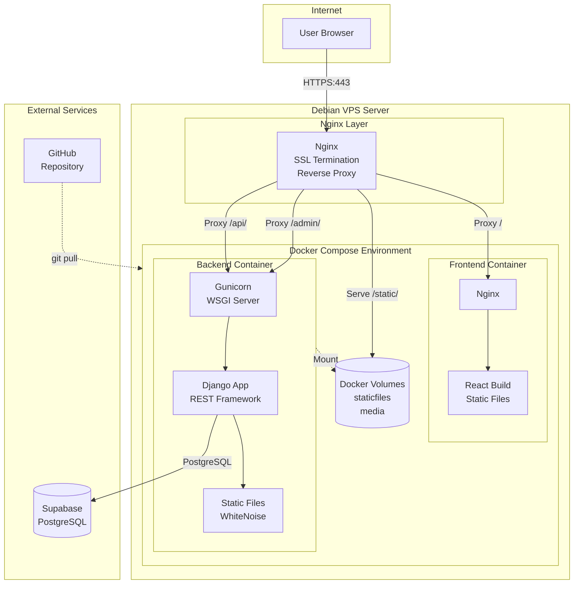
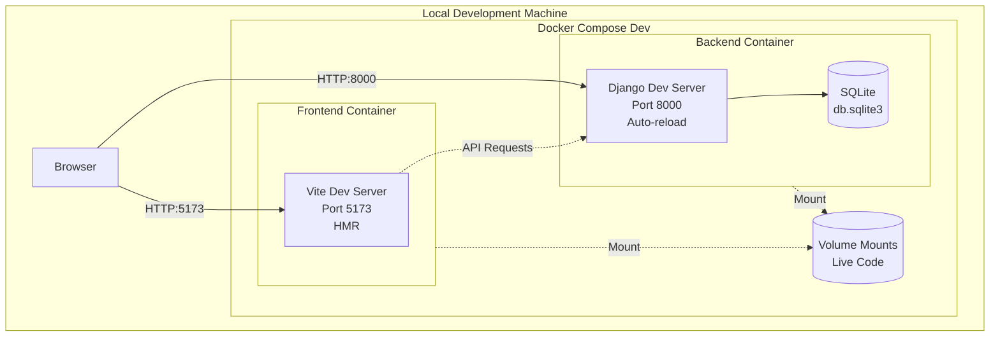
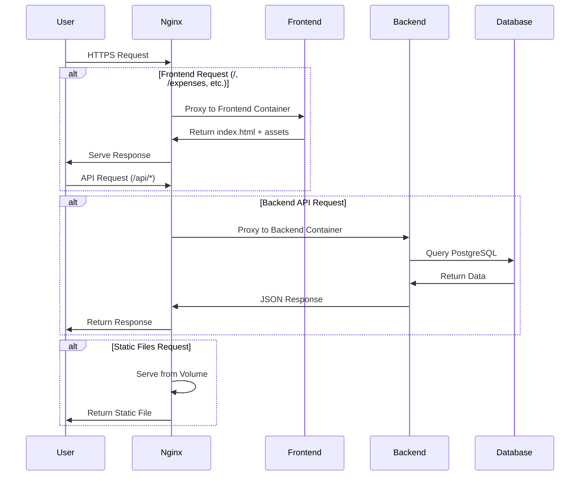
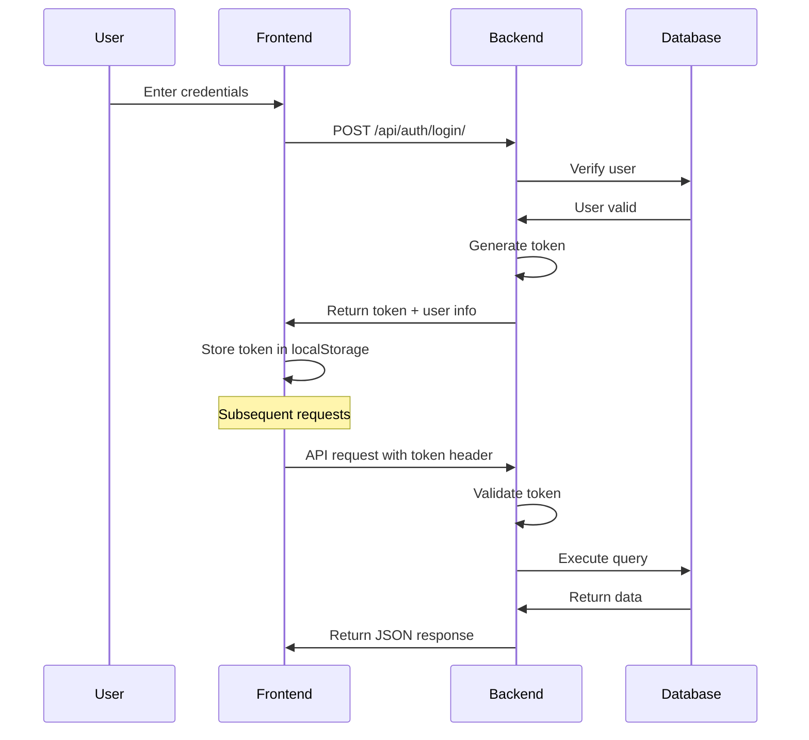
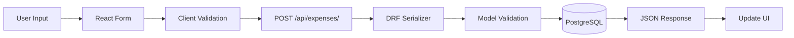
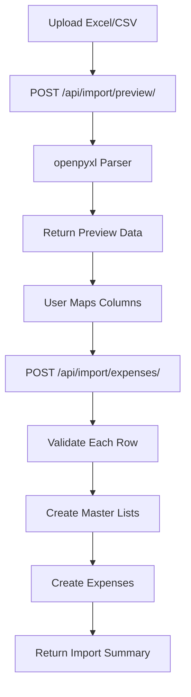
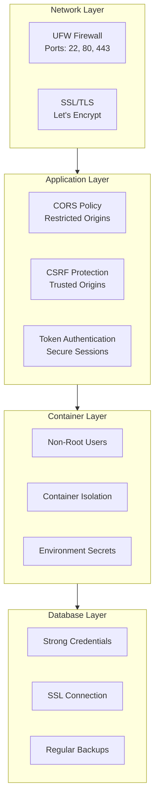
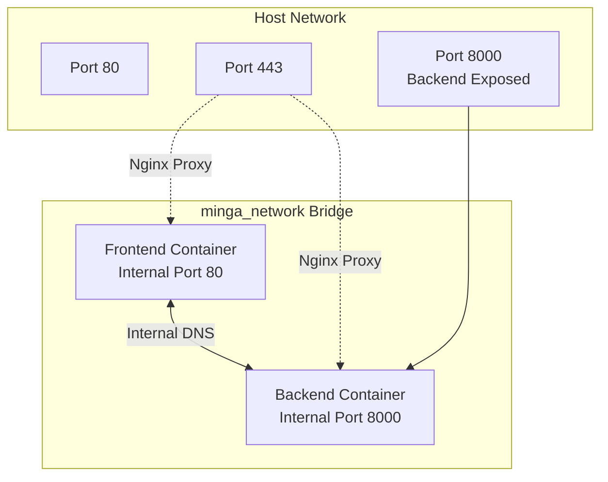
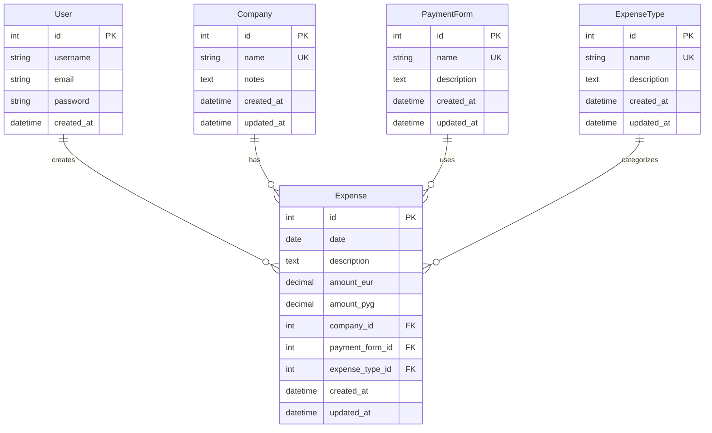

# Minga Expenses - System Architecture

Technical architecture documentation for the Minga Expenses application.

## Table of Contents

1. [System Overview](#system-overview)
2. [Architecture Diagrams](#architecture-diagrams)
3. [Component Details](#component-details)
4. [Data Flow](#data-flow)
5. [Security Architecture](#security-architecture)
6. [Deployment Architecture](#deployment-architecture)
7. [Technology Stack](#technology-stack)
8. [Database Schema](#database-schema)
9. [API Documentation](#api-documentation)
10. [Scalability Considerations](#scalability-considerations)

## System Overview

Minga Expenses is a dual-currency expense tracking application built as a modern web application with a RESTful backend and React frontend. The architecture follows a microservices-inspired design with clear separation between frontend and backend, containerized using Docker for consistent deployment.

### Key Characteristics

- **Architecture Pattern**: Client-Server with RESTful API
- **Authentication**: Token-based (Django REST Framework Token Authentication)
- **Database**: PostgreSQL (production), SQLite (development)
- **Deployment**: Docker containers orchestrated with Docker Compose
- **SSL/TLS**: Let's Encrypt certificates with automatic renewal
- **Reverse Proxy**: Nginx for SSL termination and request routing

## Architecture Diagrams

### Production Architecture



### Development Architecture



### Request Flow



### Authentication Flow



## Component Details

### Frontend Container

**Technology**: React 19 + Vite

**Production Configuration**:
- Multi-stage Docker build
- Stage 1: Build React application with Vite
- Stage 2: Serve with Nginx Alpine
- Port: 80 (internal)
- SPA routing: All routes fall back to index.html

**Key Features**:
- Token-based authentication via Axios interceptors
- React Router for client-side routing
- Tailwind CSS for styling
- Recharts for analytics visualization
- Environment-based API URL configuration

**Files**:
- Dockerfile: `CICD/Dockerfile.frontend`
- Nginx config: `CICD/nginx/default.conf`
- Source: `frontend/src/`

### Backend Container

**Technology**: Django 5.2 + Django REST Framework

**Production Configuration**:
- Base image: Python 3.11 slim
- WSGI server: Gunicorn with 3 workers
- Port: 8000 (internal)
- Static files: WhiteNoise middleware
- Non-root user for security

**Key Features**:
- RESTful API with ViewSets
- Token authentication
- CORS handling
- Dual-currency expense tracking (EUR/PYG)
- Excel/CSV import with column mapping
- Analytics endpoints with aggregations
- Django Admin interface

**Files**:
- Dockerfile: `CICD/Dockerfile.backend`
- Django settings: `core/settings.py`
- API endpoints: `expenses/urls.py`, `expenses/views.py`

### Nginx Reverse Proxy

**Purpose**: SSL termination and request routing

**Responsibilities**:
- HTTPS termination with Let's Encrypt certificates
- HTTP to HTTPS redirect
- Route frontend requests to frontend container
- Route API requests to backend container
- Serve static files directly (performance)
- Security headers
- Gzip compression

**Configuration**:
- Main config: `CICD/nginx/nginx.conf`
- Location: `/etc/nginx/sites-available/minga_expenses` (on VPS)

**Routing Rules**:
- `/` → Frontend container (port 80)
- `/api/*` → Backend container (port 8000)
- `/admin/*` → Backend container (port 8000)
- `/static/*` → Static files volume
- `/media/*` → Media files volume

### Database

**Development**: SQLite
- File: `db.sqlite3`
- No external dependencies
- Fast for local development
- Volume-mounted for persistence

**Production**: PostgreSQL (Supabase)
- Hosted database service
- Connection via environment variables
- SSL-encrypted connections
- Automated backups via Supabase

**Connection**:
- Django ORM for all database operations
- Connection pooling: `CONN_MAX_AGE = 600`
- Migrations managed with Django

## Data Flow

### Expense Creation Flow



### Data Import Flow



### Analytics Data Flow


## Security Architecture

### Defense in Depth



### Security Features

1. **Transport Security**:
   - HTTPS enforced (SSL redirect)
   - TLS 1.2+ only
   - HSTS headers
   - Secure cookies in production

2. **Authentication**:
   - Token-based authentication
   - Session security
   - CSRF protection
   - Password validation

3. **Authorization**:
   - Django permissions system
   - API requires authentication
   - Admin interface protected

4. **Container Security**:
   - Non-root users in containers
   - Minimal base images
   - No unnecessary packages
   - Secrets via environment variables

5. **Network Security**:
   - Firewall (UFW)
   - Only necessary ports open
   - Container network isolation
   - CORS restrictions

6. **Data Security**:
   - Database connection over SSL
   - Strong password requirements
   - Regular backups
   - Sensitive data in environment variables

## Deployment Architecture

### Docker Compose Structure

**Development** (`docker-compose.dev.yml`):
```yaml
services:
  backend:
    - Django dev server
    - SQLite database
    - Volume mounted code
    - Hot-reload enabled
  
  frontend:
    - Vite dev server
    - Volume mounted code
    - HMR enabled
```

**Production** (`docker-compose.prod.yml`):
```yaml
services:
  backend:
    - Gunicorn WSGI server
    - PostgreSQL connection
    - Static files collected
    - Health checks
  
  frontend:
    - Nginx serving React build
    - Optimized assets
    - Health checks

volumes:
  - staticfiles
  - media
```

### Container Networking



## Technology Stack

### Backend Stack

| Component | Technology | Version | Purpose |
|-----------|-----------|---------|---------|
| Framework | Django | 5.2.7 | Web framework |
| API | Django REST Framework | Latest | RESTful API |
| WSGI Server | Gunicorn | Latest | Production server |
| Database (Dev) | SQLite | 3 | Development database |
| Database (Prod) | PostgreSQL | 14+ | Production database |
| Static Files | WhiteNoise | Latest | Static file serving |
| CORS | django-cors-headers | Latest | CORS handling |
| Filtering | django-filter | Latest | API filtering |
| Excel Import | openpyxl | Latest | Excel file parsing |
| Environment | python-dotenv | Latest | Environment variables |
| Language | Python | 3.11 | Runtime |

### Frontend Stack

| Component | Technology | Version | Purpose |
|-----------|-----------|---------|---------|
| Framework | React | 19.1.1 | UI framework |
| Build Tool | Vite | 7.1.7 | Build and dev server |
| Routing | React Router DOM | 7.9.4 | Client-side routing |
| HTTP Client | Axios | 1.12.2 | API communication |
| Styling | Tailwind CSS | 4.1.14 | CSS framework |
| Charts | Recharts | 3.2.1 | Data visualization |
| Linting | ESLint | 9.36.0 | Code quality |
| Language | JavaScript | ES6+ | Runtime |

### Infrastructure Stack

| Component | Technology | Version | Purpose |
|-----------|-----------|---------|---------|
| Container | Docker | 20.10+ | Containerization |
| Orchestration | Docker Compose | V2 | Multi-container apps |
| Web Server | Nginx | Latest | Reverse proxy |
| SSL | Let's Encrypt | Latest | SSL certificates |
| Certbot | Certbot | Latest | Certificate automation |
| OS | Debian | 11/12 | Operating system |
| Firewall | UFW | Latest | Firewall management |

## Database Schema

### Entity Relationship Diagram



### Models Description

**User** (Django built-in):
- Standard Django user model
- Authentication and permissions
- Managed by Django admin

**Company** (Master list):
- Merchants/vendors where expenses occur
- Unique name constraint
- Soft delete protection (PROTECT on FK)

**PaymentForm** (Master list):
- Payment methods (Cash, Card, Bank Transfer, etc.)
- Unique name constraint
- Referred to as "FP" in imports

**ExpenseType** (Master list):
- Expense categories (Food, Transport, Utilities, etc.)
- Unique name constraint
- Referred to as "Tipo" in imports

**Expense** (Transaction):
- Main transaction records
- Dual currency support (EUR and/or PYG)
- Constraint: At least one currency must be filled
- Foreign keys protected (cannot delete referenced master data)
- Indexed for performance

## API Documentation

### API Endpoints

**Authentication**:
- `POST /api/auth/login/` - Login and get token
- `POST /api/auth/logout/` - Logout and delete token
- `GET /api/auth/user/` - Get current user info

**Expenses**:
- `GET /api/expenses/` - List expenses (paginated, filterable)
- `POST /api/expenses/` - Create expense
- `GET /api/expenses/{id}/` - Get expense detail
- `PUT /api/expenses/{id}/` - Update expense
- `PATCH /api/expenses/{id}/` - Partial update
- `DELETE /api/expenses/{id}/` - Delete expense

**Master Lists**:
- `GET/POST /api/companies/` - Companies CRUD
- `GET/POST /api/payment-forms/` - Payment forms CRUD
- `GET/POST /api/expense-types/` - Expense types CRUD

**Analytics**:
- `GET /api/analytics/monthly/` - Monthly totals by currency
- `GET /api/analytics/by-company/` - Totals grouped by company
- `GET /api/analytics/by-payment-form/` - Totals by payment method
- `GET /api/analytics/by-expense-type/` - Totals by expense category
- `GET /api/analytics/summary/` - Overall summary statistics
- `GET /api/analytics/export-csv/` - Export to CSV

**Import**:
- `POST /api/import/preview/` - Preview uploaded file
- `POST /api/import/expenses/` - Import expenses from Excel/CSV

### API Features

- **Pagination**: 50 items per page (customizable)
- **Filtering**: By date range, company, payment form, expense type
- **Ordering**: By any field
- **Search**: Full-text search in description and company name
- **Authentication**: Token required for all endpoints
- **CORS**: Configured for frontend origin

## Scalability Considerations

### Current Capacity

- **Users**: 1-10 concurrent users
- **Data**: ~10,000 expenses without performance issues
- **Traffic**: Low to medium (personal/small team use)
- **Database**: Single PostgreSQL instance (Supabase)

### Vertical Scaling

To handle more load on current infrastructure:

1. **Increase Gunicorn Workers**:
   ```dockerfile
   CMD ["gunicorn", "--workers", "5", ...]
   ```

2. **Add Database Connection Pooling**:
   ```python
   DATABASES['default']['CONN_MAX_AGE'] = 3600
   ```

3. **Enable Caching** (Redis):
   ```python
   CACHES = {
       'default': {
           'BACKEND': 'django.core.cache.backends.redis.RedisCache',
           'LOCATION': 'redis://redis:6379/1',
       }
   }
   ```

4. **Upgrade VPS Resources**:
   - 2GB RAM → 4GB RAM
   - 1 CPU → 2 CPU

### Horizontal Scaling

For significant growth:

1. **Load Balancer**:
   - Multiple backend containers
   - Nginx load balancing

2. **Separate Database Server**:
   - Dedicated PostgreSQL server
   - Master-replica setup

3. **Static File CDN**:
   - S3 or CloudFront
   - Offload static file serving

4. **Caching Layer**:
   - Redis for session storage
   - Cache API responses

5. **Database Optimization**:
   - Database indexing
   - Query optimization
   - Denormalization for analytics

### Monitoring Recommendations

For production at scale:

- **Application Monitoring**: Sentry for error tracking
- **Performance Monitoring**: New Relic or DataDog
- **Log Aggregation**: ELK stack or Papertrail
- **Uptime Monitoring**: UptimeRobot or Pingdom
- **Infrastructure Monitoring**: Prometheus + Grafana

## Performance Characteristics

### Current Performance

- **API Response Time**: < 200ms (typical)
- **Page Load**: < 2s (frontend)
- **Database Queries**: < 50ms (indexed queries)
- **Static Files**: < 100ms (WhiteNoise)

### Bottlenecks

1. **Database**: Most likely bottleneck at scale
2. **Gunicorn Workers**: Limited by CPU cores
3. **Static File Serving**: Volume I/O
4. **Network**: VPS bandwidth

### Optimization Opportunities

1. **Database Indexes**: Already on FKs and date fields
2. **Query Optimization**: Use select_related() and prefetch_related()
3. **Static File Caching**: Already using WhiteNoise compression
4. **API Response Caching**: Can add for analytics endpoints
5. **Frontend Code Splitting**: Vite already optimizes

## Future Architecture Enhancements

### Phase 1: Monitoring & Observability
- Add Sentry for error tracking
- Set up log aggregation
- Configure uptime monitoring
- Add performance metrics

### Phase 2: Reliability
- Implement automated backups
- Add health check endpoints
- Configure auto-restart on failure
- Set up database replication

### Phase 3: CI/CD
- GitHub Actions for automated testing
- Automated deployment on merge
- Staging environment
- Automated database migrations

### Phase 4: Scalability
- Add Redis caching layer
- Implement API rate limiting
- Database query optimization
- CDN for static files

### Phase 5: Features
- Real-time updates (WebSockets)
- Mobile app (React Native)
- Multi-tenancy support
- Advanced reporting

## Conclusion

The Minga Expenses architecture is designed for simplicity, security, and maintainability. It uses modern best practices with Docker containerization, clear separation of concerns, and comprehensive documentation. The system is ready for production deployment and has clear paths for scaling as needs grow.
